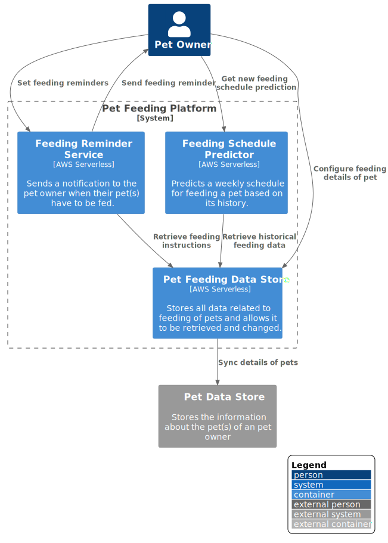

# c4-for-serverless

This repository contains how the [C4 model](https://c4model.com/) can be applied to a serverless architecture. For modeling 'diagrams as code' is used via [PlantUML](https://plantuml.com/).

## Getting started

- Install JRE
- Install graphviz
```
sudo apt install graphviz
sudo brew install graphviz
```
- Download [latest PlantUML JAR](https://plantuml.com/download), this repository already contains [PlantUML version 2022.6](https://github.com/plantuml/plantuml/releases/download/v1.2022.6/plantuml-1.2022.6.jar)
- Optionally, but recommended: install VSCode extension [PlantUML](https://marketplace.visualstudio.com/items?itemName=jebbs.plantuml)

To render the diagrams:

- Use PlantUML VSCode extension for live rendering of currently opened diagram (`PlantUML: Preview Current Diagram` command)
- Render `.puml` files to `.svg` files by running `./generate`

## C4 levels applied to Serverless

### System Context level

Do's ✅

- Keep it simple, often the team is responsible for a single system so just put a single system there.


Dont's ❌

- Describe every relation in detail, IMO it's even okay for the relations to not be 100% correct as long as the idea/design on this level is clear.


### Container level

Do's ✅

- Each container maps to a feature that the team builds.
- It's okay to mention shared 'platform' services of other teams as external containers.
- Mention just high level design decisions for each feature, in this case 'AWS Serverless'.
- Each container can be a single CloudFormation stack (as long as the whole feature is in a single AWS Region), so the documentation has a clear link with the infrastructure.

Dont's ❌

- Split up technical services (e.g. authentication, database), because they are often part of a feature. 
- Go into depth with the used AWS Resources (e.g. DynamoDB, API Gateway, etc), because it's not relevant at this level yet.



### Component level

Do's ✅

- Split up each feature into its components, which can be technical.
- Each component can map to a CDK Construct, so the documentation has a clear link with the infrastructure.
- Mention the key AWS services choosen for each component, to indicate design choices.
- Relations should show the actual protocol used, to more easily find and 'debug' this relation if necessary.


Dont's ❌

- Split it up into seperate AWS Resources, because it would make this diagram to complicated.
- Keep other containers/systems in the diagram that have a relation with the currently focussed container, this would add noise to the diagram.


### Code level

Do's ✅

- Document 'common' code level patterns, e.g. how is the database exposed or how is pub/sub set up. 
- It's okay for this to not have any C4 stuff, it should be as close to the actual code as possible.

Dont's ❌

- Make a code level diagram for each component, because this would be a lot of work to make and keep in sync. Instead it should capture common patterns. If necessary CloudFormation/CDK code can be used to easily view the resources of a component due to previous levels mapping to CloudFormation stacks/CDK constructs.


## TODO

- Links between diagrams